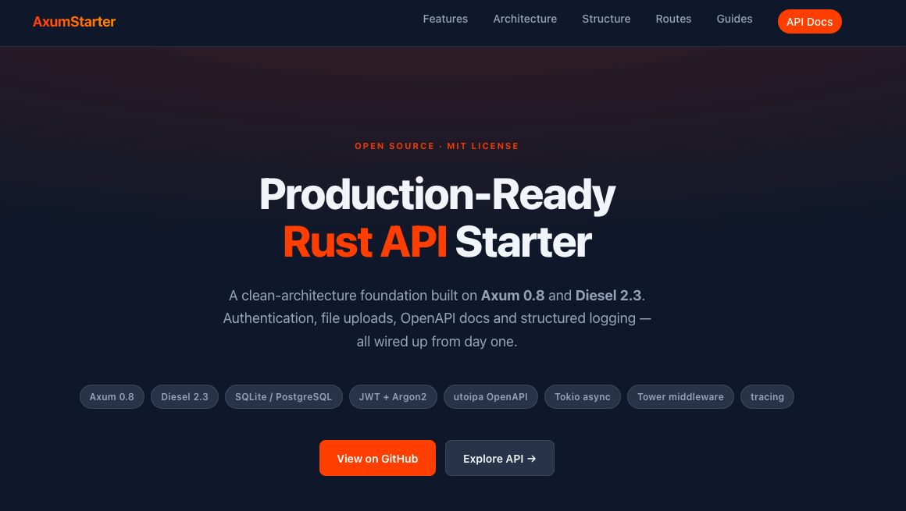

# Axum Starter



A production-ready Rust API starter kit built with Axum, featuring JWT authentication, file uploads, OpenAPI docs, and clean layered architecture.

[](https://www.paypal.me/thomilive)

## Features

- **Axum 0.8** — Modern async web framework
- **Diesel 2.3** — SQLite (dev/test) and PostgreSQL (production)
- **JWT + Argon2** — Authentication with secure password hashing
- **File Uploads** — Multipart form extractor with MIME type validation
- **utoipa OpenAPI** — Auto-generated Swagger UI (non-production only)
- **Structured Logging** — Tracing with JSON output
- **Clean Architecture** — Repository → Service → Controller layers
- **Snowflake IDs** — Distributed-safe ID generation

## Quick Start

```bash
# Development
./run.sh dev

# Run tests
cargo test

# View API docs (development only)
open http://localhost:3000/spec
```

## Task Runner (`run.sh`)

This project uses `run.sh` as a task runner. Always use it instead of running `cargo` directly — it loads the correct `.env` file before executing.

### Available Commands

| Command                   | Description                                     |
| ------------------------- | ----------------------------------------------- |
| `./run.sh dev`            | Load `.env.local`, run with cargo-watch         |
| `./run.sh dev:staging`    | Load `.env.staging`, run cargo run              |
| `./run.sh dev:production` | Load `.env.production`, run cargo run --release |
| `./run.sh start:staging`  | Load `.env.staging`, exec release binary        |
| `./run.sh start`          | Load `.env.production`, exec release binary     |
| `./run.sh build`          | cargo build --release                           |
| `./run.sh bin:ensure`     | Build/verify the release binary without running |
| `./run.sh lint`           | cargo clippy -D warnings                        |
| `./run.sh lint:fix`       | cargo clippy --fix                              |
| `./run.sh format`         | cargo fmt                                       |
| `./run.sh docker:up`      | docker compose up -d --build                    |
| `./run.sh docker:down`    | docker compose down                             |

`start` / `start:staging` run the compiled binary via `run.sh`, so local production/staging smoke tests exercise the same artifact Docker ships. Use `./run.sh bin:ensure` when CI or your workflow needs to pre-build the binary before starting containers.

In containerized environments, always use the `docker:*` commands above (not raw `docker compose`) so the same env-loading workflow applies regardless of how the app runs.

### Database Commands

| Command                             | Description            |
| ----------------------------------- | ---------------------- |
| `./run.sh db:migration:create NAME` | Create new migration   |
| `./run.sh db:migration:run`         | Run pending migrations |
| `./run.sh db:migration:revert`      | Revert last migration  |
| `./run.sh db:migration:status`      | List migration status  |

### Passing Extra Args

```bash
# Pass args to cargo after --
./run.sh dev -- --bin myapp --features tracing
```

### Environment Files

| File              | Environment                     |
| ----------------- | ------------------------------- |
| `.env.local`      | Development (default for `dev`) |
| `.env.staging`    | Staging environment             |
| `.env.production` | Production environment          |

## API Endpoints

| Method | Path                | Description                | Auth |
| ------ | ------------------- | -------------------------- | ---- |
| GET    | `/health/live`      | Liveness probe             | No   |
| GET    | `/health/ready`     | Readiness probe (DB check) | No   |
| POST   | `/auth/register`    | Create new account         | No   |
| POST   | `/auth/login`       | Login with credentials     | No   |
| POST   | `/auth/refresh`     | Refresh access token       | No   |
| GET    | `/users/me`         | Get current user           | Yes  |
| GET    | `/attachments`      | List attachments           | Yes  |
| POST   | `/attachments`      | Upload file                | Yes  |
| GET    | `/attachments/{id}` | Get attachment             | Yes  |
| DELETE | `/attachments/{id}` | Delete attachment          | Yes  |

Swagger UI is available at `/spec` in development. OpenAPI JSON at `/api-docs/openapi.json`.

## Project Structure

```
src/
├── main.rs              # Entry point, tracing init, AppState creation
├── lib.rs               # Module declarations
├── config.rs            # Environment loading, CORS origins parsing
├── server.rs            # AppServer, middleware layers, graceful shutdown
├── models/              # Shared domain models
│   └── environment.rs   # AppState, environment config struct
├── modules/             # Feature modules (vertical slices)
│   ├── doc.rs           # ApiDoc aggregator, swagger_router()
│   ├── auth/            # Authentication (register, login, refresh)
│   ├── user/            # User management
│   ├── health/          # Health check endpoints
│   └── attachment/      # File upload/management
├── extractors/          # Custom Axum extractors
│   ├── auth.rs          # AuthUser (JWT validation, no middleware needed)
│   ├── body.rs          # JSON body extractor with validation
│   └── formdata.rs      # Multipart form extractor with file validation
├── services/            # Infrastructure services
│   ├── http_error.rs    # HttpError type, service error mapper
│   ├── http_response.rs # HttpResponse type
│   └── sqlite.rs        # DBSqlite connection pool wrapper
├── schemas/             # Diesel table definitions
│   └── table.rs         # table! macros
└── utils/               # Shared utilities
    ├── token.rs         # JWT creation/verification
    ├── encrypt.rs       # Password hashing (argon2)
    ├── files.rs         # File upload/delete utilities
    ├── generator.rs     # Snowflake ID generator
    ├── validation.rs    # Shared validation error formatter
    └── integer.rs       # Numeric conversion utilities

guide/
├── ARCHITECTURE.md      # System architecture, data flow, request lifecycle
├── CONVENTIONS.md       # Module structure, naming, error handling patterns
└── RULES.md             # Do's and don'ts for the codebase

migrations/              # Diesel database migrations
tests/                   # Integration tests
```

## Architecture

The project follows a strict layered architecture with unidirectional dependencies:

```
Controller  →  Service  →  Repository
 (HTTP)       (Logic)      (Database)
```

- **Controller** — HTTP handlers, extracts input, maps errors to HTTP responses
- **Service** — Business logic, no HTTP dependencies, returns `anyhow::Result<T>`
- **Repository** — Diesel queries only, returns `anyhow::Result<T>`

Errors bubble up as string codes (`"NOT_FOUND"`, `"EMAIL_ALREADY_EXISTS"`) and are mapped to HTTP status codes at the controller boundary via `HttpError::from_service_error()`.

Authentication uses a **self-contained extractor** (`AuthUser`) — no separate middleware needed. Handlers declare auth requirement directly in their signature:

```rust
pub async fn get_me(auth: AuthUser) -> Result<impl IntoResponse, HttpError>
```

## Environment Variables

```bash
# Required
APP_ENV=development
APP_SECRET=your-secret-key-min-32-chars
DATABASE_URL=sqlite://dev.db

# Optional
CORS_ORIGINS=http://localhost:3000,http://localhost:5173
```

## Docker

Container builds follow the same flow as production:

1. `./run.sh bin:ensure` (or `cargo build --release`) compiles `target/release/axum-starter`.
2. The Docker builder stage copies that binary to `/app/api`.
3. The runtime stage invokes `./run.sh start` (default) or `./run.sh start:staging`, so the script loads the right `.env` file before exec-ing the shipped binary.

```bash
# Start all services (production config, runs ./run.sh start inside the container)
./run.sh docker:up

# Stop all services
./run.sh docker:down
```

To test staging behaviour inside Docker, override the command when launching:

```bash
docker compose run --rm app start:staging
```

Because the image entrypoint is `./run.sh`, passing `start:staging` (or any other script command) is enough.

## Testing

```bash
# Run all tests
cargo test

# Run specific test
cargo test test_register_new_user

# Run with output
cargo test -- --nocapture
```

Each test gets an isolated SQLite database via `TestApp::new()`.

## Documentation

- **[Architecture Guide](guide/ARCHITECTURE.md)** — System design, layered architecture, request lifecycle, OpenAPI setup
- **[Coding Conventions](guide/CONVENTIONS.md)** — Module structure, naming conventions, error handling patterns
- **[Development Rules](guide/RULES.md)** — Do's and don'ts, workflow rules, security guidelines

## License

MIT
